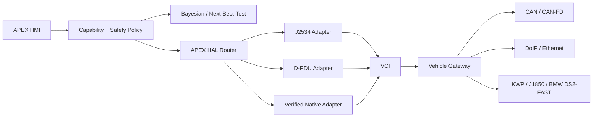

# APEX Phase 8 — Commercial Diagnostic Capability Assimilation

## Scope
Clean-room capability architecture derived from public standards and public product capabilities. No proprietary Autel/Bosch/Snap-on databases, binaries, seed-key algorithms, credentials, or firmware are copied.

## Architecture


## Flagship capability matrix
| Capability | APEX model | Fail-closed gate |
|---|---|---|
| ECU topology | NetworkNode + NetworkEdge + GatewayRoute | observed/verified node identity |
| DTC/live data | DiagnosticService | verified binding only |
| Active tests | DiagnosticAction ACTIVE_TEST | verified transport + explicit safety predicates |
| Variant coding | DiagnosticAction CODING | exact ECU identity + authorized data + audit |
| Programming | FlashArtifact + ProgrammingSession | exact HW/SW target + SHA-256 + voltage/state + backup + explicit authorization |
| Repair assist / TSB | KnowledgeFact with provenance tier | OEM facts never promoted from empirical cases |
| ADAS calibration | CalibrationProcedure | verified target/procedure + required equipment + state gates |
| Security/key workflows | SECURITY_AUTH capability boundary | authorized OEM workflow only; no bypass/secret derivation logic |

## Unified diagnostic database
Core entities:
- VehicleIdentity(VIN, platform, model-year)
- EcuIdentity(address, logical-address, hardware-id, software-id, variant)
- DiagnosticDefinition(source-format, source-hash, provenance)
- DiagnosticService(request/response semantics)
- DataObject(coding/physical conversion)
- NetworkNode / NetworkEdge / GatewayRoute
- FlashArtifact(hash, target constraints, provenance)
- CalibrationProcedure
- KnowledgeFact(provenance tier)
- CapabilityBinding(ECU variant -> supported action)

Importers are adapters, never the canonical model: EDIABAS/SGBD -> canonical; ODX/PDX -> canonical; legally obtained vendor-specific definitions -> canonical. Raw imported objects retain source hash and provenance.

Recommended lookup indexes:
1. exact (VIN/platform, ECU logical address)
2. exact (hardware_id, software_id)
3. exact (definition source_hash)
4. composite (manufacturer, platform, ECU family, variant)
No fuzzy match may authorize write/coding/programming.

## Topology
Use observed gateway enumeration plus imported network definitions. Nodes and edges carry independent evidence states. A visually plausible topology is not treated as observed topology.

## Programming / coding
Artifacts are content-addressed by SHA-256 and constrained to an exact ECU identity/variant. Programming remains a separate privileged state machine:
DISCOVER -> IDENTIFY -> COMPATIBILITY_VERIFIED -> ARTIFACT_VERIFIED -> PREFLIGHT -> AUTHORIZED -> EXECUTE -> VERIFY.
Any unknown state terminates before EXECUTE.

## Knowledge provenance
TIER_1_OEM_FACT, VERIFIED_TELEMETRY, CONTROLLED_TEST, EMPIRICAL_CASE remain separate namespaces. Repair cases may propose a hypothesis/test but cannot rewrite OEM facts or become TRACE_VERIFIED telemetry.

## Active tests
Every action declares required predicates (examples: known speed, known RPM, supply-state constraints). Unknown vehicle state fails closed. Safety predicates belong to the definition, not UI code.

## ADAS
Represent calibration as a procedure descriptor: sensor type, static/dynamic mode, prerequisites, target/equipment identifiers, environmental constraints, observations and pass criteria. APEX should orchestrate only a verified manufacturer procedure; it must not invent calibration geometry.

## Security access
APEX models authorization and capability state, but intentionally contains no generic immobilizer bypass, secret extraction, seed-key cracking, or arbitrary EEPROM manipulation path. Legitimate key/security operations delegate to authorized OEM/provider workflows.

## Utility expansion
Every candidate graph action declares actionClass, expected-information model, monetary/time cost, invasiveness and operational risk. Passive reads normally occupy a lower burden class than active commands; mechanical disassembly can occupy a higher burden class. Numeric values must come from a versioned calibration model rather than hard-coded brand assumptions.

## Phase-8 JSON action node
```json
{
  "actionId": "manufacturer.verified.action",
  "actionClass": "ACTIVE_TEST",
  "hypotheses": ["H1"],
  "burden": {"monetaryCost":0.0,"timeCost":0.0,"invasiveness":0.0,"operationalRisk":0.0},
  "requiredCapabilities": ["VERIFIED_BIDIRECTIONAL_CONTROL"],
  "requiredSafetyPredicates": ["VEHICLE_STATE_KNOWN"],
  "conditionalModelVerified": false
}
```
With conditionalModelVerified=false the Utility Engine returns INSUFFICIENT_MODEL_EVIDENCE.
